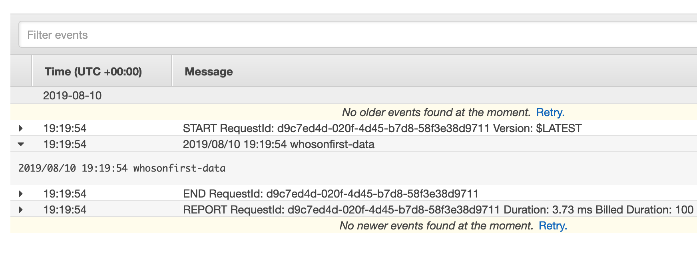

# go-webhookd-aws

What is the simplest webhook-wrangling server-daemon-thing (`go-webhookd`) that can run as an AWS Lambda function.

## Important

This is work in progress and the documentation is not complete yet. There is also a possibility this code will get merged back in to [go-webhookd](https://github.com/whosonfirst/go-webhookd) itself. I'm not sure yet.

## Install

You will need to have both `Go` (specifically version [1.12](https://golang.org/dl) or higher) and the `make` programs installed on your computer. Assuming you do just type:

```
make tools
```

All of this package's dependencies are bundled with the code in the `vendor` directory.

## Tools

### webhookd-flatten-config

A helper utility for encoding a valid webhookd config file in to a string that can be copy-paste-ed as a `webhookd-lambda` environment variable.

```
./bin/webhookd-flatten-config -config config.json
{"daemon":{"host":"localhost","port":8080,"allow_debug":false},"receivers":{"github":{"name":"GitHub","secret":"s33kret","Ref":"refs/heads/master"},"insecure":{"name":"Insecure","Ref":""}},"dispatchers":{"log":{"name":"Log"},"null":{"name":"Null"}},"transformations":{"chicken":{"name":"Chicken","language":"zxx"},"clucking":{"name":"Chicken","language":"eng","clucking":true},"commits":{"name":"GitHubCommits","exclude_additions":true,"exclude_modifications":true,"exclude_deletions":true},"null":{"name":"Null"}},"webhooks":[{"endpoint":"/github-test","receiver":"github","transformations":["chicken"],"dispatchers":["log"]},{"endpoint":"/insecure-test","receiver":"insecure","transformations":["chicken"],"dispatchers":["log"]}]}
```

### webhookd-lambda

This will run `webhookd` HTTP daemon as a Lambda function. In order to use it you will need to configure an AWS API Gateway endpoint.

#### Roles

Your Lambda function will need to run using a role with the following built-in AWS policies:

* `AWSLambdaBasicExecutionRole`

#### Environment variables

| Key | Value |
| --- | --- |
| WEBHOOKD_CONFIG | A valid JSON encoded `webhookd` config file | 

Including a big honking string here is not ideal, it's just how it is today. For now you'll just have to use the `webhookd-flatten-config` tool described above. Really, this should be stored in something like the AWS Secrets Manager but that will have to be "tomorrow's problem".

For example, let's start with a config file that looks like this:

```
{
    	"daemon": {
		"protocol": "http",
		"host": "localhost",
		"port": 8080
	},
	"receivers": {
		"insecure": {
			"name": "Insecure"
		}		
	},	
	"transformations": {
		"chicken": {
			"name": "Chicken",
			"language": "zxx",
			"clucking": false
		}				
		
	},
	"dispatchers": {
		"log": {
			"name": "Log"
		}
	},
	"webhooks": [
		{
			"endpoint": "/insecure",
		 	"receiver": "insecure",
			"transformations": [ "chicken" ],
			"dispatchers": [ "log" ]
		}
	]
}
```

For details on `webhookd` config file please consult the [go-webhookd documentation](https://github.com/whosonfirst/go-webhookd#config-files).

And an AWS Lambda test event configured to act like an AWS API Gateway Proxy event like this:

```
{
  "body": "hello world",
  "resource": "/{proxy+}",
  "path": "/insecure",
  "httpMethod": "POST",
  "isBase64Encoded": false,
  "pathParameters": {
    "proxy": "/insecure"
  },
  "headers": {
    "Accept": "text/html,application/xhtml+xml,application/xml;q=0.9,image/webp,*/*;q=0.8",
    "Accept-Encoding": "gzip, deflate, sdch",
    "Accept-Language": "en-US,en;q=0.8",
    "Cache-Control": "max-age=0",
    "CloudFront-Forwarded-Proto": "https",
    "CloudFront-Is-Desktop-Viewer": "true",
    "CloudFront-Is-Mobile-Viewer": "false",
    "CloudFront-Is-SmartTV-Viewer": "false",
    "CloudFront-Is-Tablet-Viewer": "false",
    "CloudFront-Viewer-Country": "US",
    "Host": "1234567890.execute-api.us-east-1.amazonaws.com",
    "Upgrade-Insecure-Requests": "1",
    "User-Agent": "Custom User Agent String",
    "Via": "1.1 08f323deadbeefa7af34d5feb414ce27.cloudfront.net (CloudFront)",
    "X-Amz-Cf-Id": "cDehVQoZnx43VYQb9j2-nvCh-9z396Uhbp027Y2JvkCPNLmGJHqlaA==",
    "X-Forwarded-For": "127.0.0.1, 127.0.0.2",
    "X-Forwarded-Port": "443",
    "X-Forwarded-Proto": "https"
  }
}
```

When you run the test you should see something like this:

```
START RequestId: 5c237ed9-f03f-407f-acaa-433625aa6950 Version: $LATEST
2019/08/10 18:08:09 🐔 🐔
END RequestId: 5c237ed9-f03f-407f-acaa-433625aa6950
REPORT RequestId: 5c237ed9-f03f-407f-acaa-433625aa6950	Duration: 3.14 ms	Billed Duration: 100 ms 	Memory Size: 512 MB	Max Memory Used: 55 MB	
```

Specifically the string `hello world` was received by the "insecure" receiver, transformed in to `🐔 🐔` by the "chicken" transformer and distpatched to STDOUT (or in the case of AWS to CloudWatch) using the "log" dispatcher.

For details on receivers, transformers and dispatchers please consult the main [go-webhookd documentation](https://github.com/whosonfirst/go-webhookd/blob/master/README.md).

#### API Gateway

In order to send requests to the `webhookd` Lambda function over HTTP you need to configure an API Gateway instance to sit in front of it (the Lambda function) and proxy requests and responses.

* Create a new API Gateway API
* Create a new resource for that API
* Configure as "proxy resource" (enable API Gateway CORS if you think that's necessary)
* Delete the `ANY` method and create a new `POST` method
* Configure it (the `POST` method) to use the "Lambda Function Proxy" integration type and associate it with whatever you've named your Lambda function (above)
* Deploy your API Gateway API (for the purposes of this example we're going to say you called it `STAGE`)

Now let's say we have a file called `test.svg` that looks like this:

```
<svg width="512.000000" height="512.000000" viewBox="0 0 512 512" xmlns="http://www.w3.org/2000/svg"><path d="M512.000000 51.171577,502.111346 59.685313,500.130702 79.677695,505.024057 80.118699,507.237717 85.263736,512.000000 83.358551,512.000000 511.923681,0.000000 511.923681,0.000000 0.000000,512.000000 0.000000,512.000000 51.171577 Z" fill="#ffffff" fill-opacity="0.5" kind="ocean" sort_rank="200" stroke="#000000" stroke_opacity="1"/><path d="M512.000000 51.171577,502.111346 59.685313,500.130702 79.677695,505.024057 80.118699,507.237717 85.263736,512.000000 83.358551" fill="#ffffff" fill-opacity="0" kind="ocean" sort_rank="205" stroke="#000000" stroke_opacity="1"/></svg>
```

Your API gateway lives at `EXAMPLE.execute-api.us-east-1.amazonaws.com/STAGE` so you would post your SVG file like this:
 
```
$> curl -v -X POST https://EXAMPLE.execute-api.us-east-1.amazonaws.com/STAGE/insecure. -d@test.svg
...
> POST /STAGE/insecure HTTP/2
> Host: EXAMPLE.execute-api.us-east-1.amazonaws.com
> User-Agent: curl/7.54.0
> Accept: */*
> Content-Length: 682
> Content-Type: application/x-www-form-urlencoded
> 
* Connection state changed (MAX_CONCURRENT_STREAMS updated)!
* We are completely uploaded and fine
< HTTP/2 200 
< date: Sat, 10 Aug 2019 18:57:08 GMT
< content-type: application/json
< content-length: 0
< x-amzn-requestid: a714f2c0-bba0-11e9-95d9-2510c8e0110e
< x-webhookd-time-to-receive: 8.491?s
< x-webhookd-time-to-transform: 1.391499ms
< x-amz-apigw-id: EXAMPLE
< x-webhookd-time-to-process: 1.454697ms
< x-webhookd-time-to-dispatch: 54.153?s
```

And in your CloudWatch logs you'd see something like this:

```
2019/08/10 18:57:08 🐔-🐔 🐔🐔 🐔🐔 🐔"512.000000" 🐔🐔 🐔"512.000000" 🐔🐔 🐔"0 0 512 512" 🐔🐔 🐔"🐔://🐔.🐔3.🐔/2000/🐔"🐔-🐔 🐔🐔-🐔 🐔🐔 🐔🐔 🐔"🐔512.000000 51.171577,502.111346 59.685313,500.130702 79.677695,505.024057 80.118699,507.237717 85.263736,512.000000 83.358551,512.000000 511.923681,0.000000 511.923681,0.000000 0.000000,512.000000 0.000000,512.000000 51.171577 🐔" 🐔🐔 🐔"#🐔" 🐔-🐔🐔 🐔"0.5" 🐔🐔 🐔"🐔" 🐔_🐔🐔 🐔"200" 🐔🐔 🐔"#000000" 🐔_🐔🐔 🐔"1"/🐔-🐔 🐔🐔-🐔 🐔🐔 🐔🐔 🐔"🐔512.000000 51.171577,502.111346 59.685313,500.130702 79.677695,505.024057 80.118699,507.237717 85.263736,512.000000 83.358551" 🐔🐔 🐔"#🐔" 🐔-🐔🐔 🐔"0" 🐔🐔 🐔"🐔" 🐔_🐔🐔 🐔"205" 🐔🐔 🐔"#000000" 🐔_🐔🐔 🐔"1"/🐔-🐔 🐔🐔-🐔 🐔/🐔🐔-🐔 🐔
```

As of this writing it is not possible to send back the value of a transformation in the response body of a (`webhookd`) request.

#### A more concrete example

Here's another example that doesn't involve chickens (🐔). In this example we'll configure `webhookd` to listen for webhooks sent by GitHub and log the names of the repository that sent the hook.

Your config file should look like this, albeit with specific secrets and endpoints:

```
{
    "daemon": {
		"protocol": "http",
		"host": "localhost",
		"port": 8080
	},
	"receivers": {
		"github": {
			"name": "GitHub",
			"secret": "S33KRET",
			"ref": "refs/heads/master"
		}			    
	},	
	"transformations": {
		"repo": {
			"name": "GitHubRepo",
			"exclude_additions": false,
			"exclude_modifications": false,
			"exclude_deletions": true
		}				
		
	},
	"dispatchers": {
		"log": {
			"name": "Log"
		}
	},
	"webhooks": [
		{
		    "endpoint": "/ENDPOINT",
		    "receiver": "github",
		    "transformations": [ "repo" ],
		    "dispatchers": [ "log" ]
		}	    
	]
}
```

In the "Webhooks settings" page for your GitHub repository in question you'll want to plug in the following:

| Key | Value |
| --- | --- |
| Payload URL | https://EXAMPLE.execute-api.us-east-1.amazonaws.com/STAGE/ENDPOINT |
| Content type | application/json |
| Secret | S33KRET |

Where things like `EXAMPLE` and `ENDPOINT` and especially `S33KRET` are specific to your application.

In this example we have configured the [GitHub "receiver"](https://github.com/whosonfirst/go-webhookd#github) to only pay attention to things that have been committed to the `master` branch and we have configured the [GitHubRepo "transformer"](https://github.com/whosonfirst/go-webhookd#githubrepo) to ignore any deletion events (in the commit).

As with the other examples we're "dispatching" everything to the ["log" dispatcher](https://github.com/whosonfirst/go-webhookd#log) so the output would like something like this:



### webhookd-lambda-task

This is a Lambda function to run an ECS task when invoked. It is principally meant to be used with the `go-webhookd` Lambda dispatcher. It should probably be renamed since it's pretty confusing, even for me.

_The documentation for this tool is still being written..._

## See also

* https://github.com/whosonfirst/go-webhookd
* https://github.com/whosonfirst/algnhsa